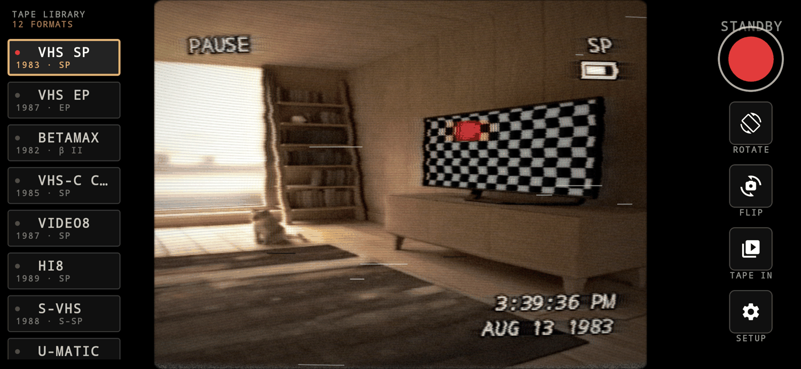
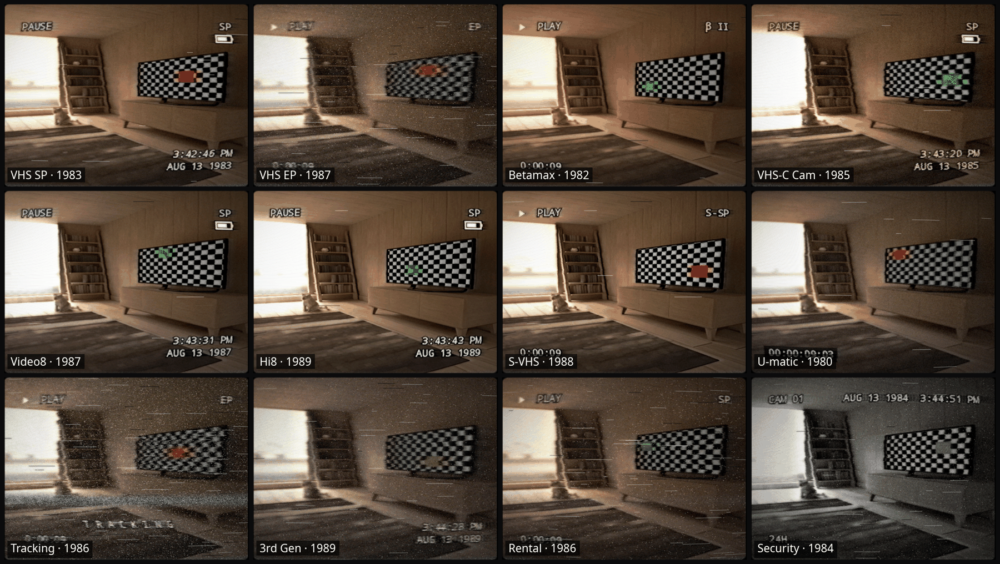
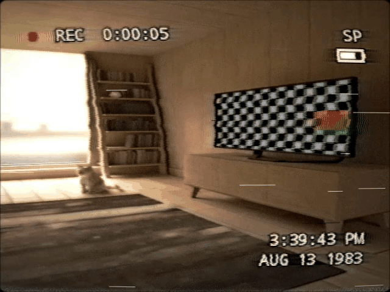
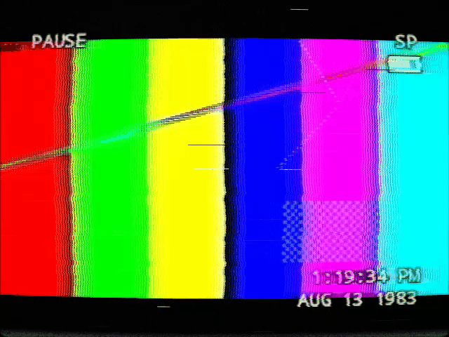
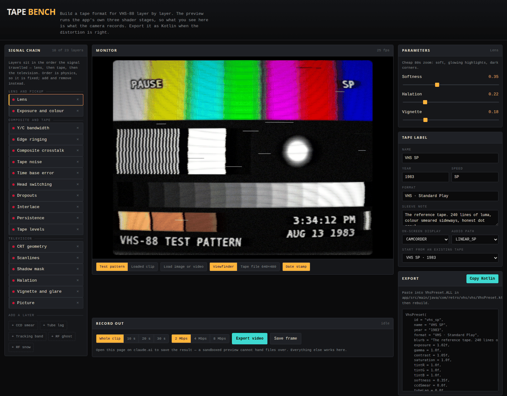
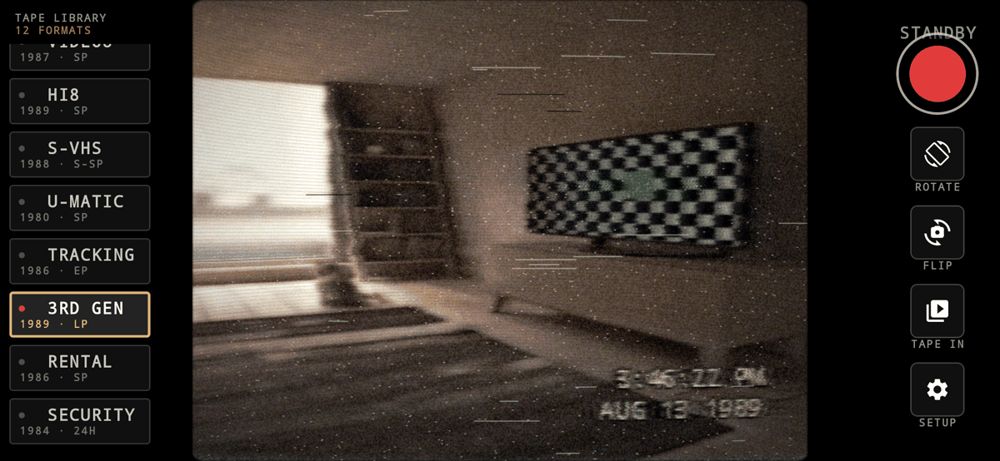

<div align="center">

# VHS-88

**An Android camcorder that films through a 1980s video chain.**

Twelve tape formats, each modelled as a signal path rather than a colour grade with
noise dropped on top.

**MIT licence** · Android 8.0+ · Kotlin + GLES 2.0



</div>

---

## What it does

- **Record** through the filter, live, with sound.
- **Dub** an existing video from your gallery through the same chain.
- **Twelve formats**, from a clean Hi8 to a tape that has been through 400 rentals.
- **Period-correct audio** — the microphone is band-limited, saturated, hissed and
  wobbled to match the machine. A linear VHS edge track sounds nothing like Hi-Fi AFM.
- **Tape Bench**, a browser tool for building your own format layer by layer.

Everything you see in the viewfinder is what lands in the file: the preview and the
encoder are drawn from the same filtered frame, in the same GL context. Output goes to
`Movies/VHS-88/` as H.264 + AAC MP4.

---

## The twelve tapes



| | Format | Year | What makes it different |
|---|---|---|---|
| 1 | **VHS SP** | 1983 | The reference. ~240 lines of luma, chroma smeared sideways, honest dot crawl. |
| 2 | **VHS EP** | 1987 | Six hours on one T-120. A third of the tape speed and it shows in everything. |
| 3 | **Betamax** | 1982 | Sony's better picture. Tighter luma, warmer, steadier transport. |
| 4 | **VHS-C Cam** | 1985 | Palmcorder with a single-chip CCD. Vertical smear off every highlight, date on every frame. |
| 5 | **Video8** | 1987 | Metal particle tape. Cleaner, cooler, and the first one that sounded good. |
| 6 | **Hi8** | 1989 | End-of-decade prosumer. 400 lines over S-video, so no dot crawl at all. |
| 7 | **S-VHS** | 1988 | Luma kept apart from chroma. Sharp, ringy, still tape. |
| 8 | **U-matic** | 1980 | Local news on a shoulder rig, shot on a pickup tube — highlights bloom and drag comet trails. |
| 9 | **Tracking** | 1986 | Nobody adjusted the tracking dial. Noise bands crawl up the picture and the colour drops out. |
| 10 | **3rd Gen** | 1989 | Copy of a copy of a copy over an aerial lead. Ghosted, washed out, ringing on every edge. |
| 11 | **Rental** | 1986 | Be kind, rewind. Shed oxide, creased tape, a lifetime of other people's VCRs. |
| 12 | **Security** | 1984 | Lobby camera on a 24-hour time-lapse deck. Washed out, over-sharpened, always stamped. |

---

## How the picture is made

Three GL passes, in the order the signal actually travelled, all on GLES 2.0 at a fixed
640×480 working raster — the artefacts are tuned in pixels, so the look does not change
with the output size.

<table>
<tr>
<td width="50%"></td>
<td width="50%"></td>
</tr>
<tr>
<td><em>A frame as recorded — 640×480, filter baked in.</em></td>
<td><em>A 16:9 clip dubbed to tape, letterboxed into the 4:3 raster.</em></td>
</tr>
</table>

### 1. Lens and pickup — `FRAG_PICKUP`

| Effect | Why it is there |
|---|---|
| Vertical smear | An interline-transfer CCD leaking charge down the column under a specular highlight. The 80s camcorder signature nobody could avoid. |
| Comet trails | Pickup-tube lag: before CCDs, bright areas kept glowing for several frames. |
| Halation, softness, vignette | Cheap zoom lens and prism block. |
| Exposure / gamma / tint | Each machine's own colorimetry. |
| OSD burn-in | The character generator sat *before* the recording head, so the date stamp gets smeared and jittered by everything downstream — as it should. |

### 2. Composite encode and the tape — `FRAG_TAPE`

Done in YIQ, because that is where the losses happened.

| Effect | Why it is there |
|---|---|
| Luma bandwidth | VHS recorded luma as an FM carrier with roughly 3 MHz of usable bandwidth. |
| Chroma bandwidth and delay | Colour-under chroma had about 400 kHz — colour bleeds sideways for a dozen pixels and lands slightly to the right. |
| Pre-emphasis ringing | The recorder's boost that the player never quite undid: the bright fringe on the trailing edge of every hard transition. |
| Dot crawl | Chroma leaking into luma at the 3.58 MHz subcarrier, phase-flipped per line and per field, so it crawls. Absent on the S-video presets. |
| Cross-colour | Fine luma detail leaking the other way, into chroma: rainbows on striped shirts. |
| Time-base error | No consumer deck had a TBC. Per-line jitter plus a slow drift. |
| Head switching | The torn, noisy band at the bottom of every field. |
| Mistracking | A noise band that drifts up the picture and takes the colour with it. |
| Dropouts | Shed oxide — the head reads nothing for part of a line. |
| Tape noise | Luma grain that rises in the shadows; coarse, blocky chroma noise. |
| Interlace | Each field refreshes only every other line, so motion combs — driven off the previous frame, not faked. |
| RF ghost | Multipath, the giveaway of a dub made over an aerial lead. |

### 3. The television — `FRAG_CRT`

Barrel geometry, overscan (which is what hid the head-switching band in real life),
scanlines, aperture-grille mask, halation bloom, vignette, screen glare, rounded corners.

The line structure and the phosphor mask are gated on output oversampling: rendering 480
scanlines into a 480-pixel-tall frame is not a CRT, it is a moiré pattern. They fade in
as the output gains the resolution to draw them — full strength in the viewfinder and at
`High · 1280×960`, off in a 1:1 `Tape · 640×480` file, whose rows *are* the scanlines.

### And the audio

A linear VHS audio track ran past a fixed head at tape speed, so it lost everything above
~10 kHz (~5 kHz at EP), hissed, saturated early, and wobbled — wow at well under a hertz,
flutter at a few hertz. `VhsAudioProcessor` reproduces that with a modulated fractional
delay line, one-pole head response, soft saturation and level dropouts. The Hi-Fi AFM
presets (Video8, Hi8, S-VHS) get a genuinely good-sounding profile instead, in stereo.

---

## Tape Bench



A browser tool for building your own format — and for putting video through the filter
without an Android phone at all. Open **[`tools/tape-bench.html`](tools/tape-bench.html)**:
one self-contained file, no build step, nothing to install, no server.

- The preview runs **the app's own three shader stages**, extracted from
  `VhsShaders.kt` at build time, so the monitor cannot drift from what the camera records.
- **23 layers** in signal order — lens, tape, television. Add and remove them; order is
  physics, so it is fixed.
- Judge it against a built-in test pattern designed to expose every artefact at once, or
  load your own image or clip.
- **Export the Kotlin** and paste it into `VhsPreset.ALL`, or **export the filtered
  video**.

### Using it to convert video

Load a clip, choose a tape, press **Export video**. You get an MP4 with the picture
filtered and the sound dragged through that machine's audio path. The file is one HTML
document, so you can hand it to someone and they need nothing else.

**What it needs:** a recent Chrome or Edge for MP4 output. Firefox works but records
WebM. Nothing is uploaded anywhere — the clip never leaves the machine it is opened on.

**What to expect:**

| | |
|---|---|
| Speed | Real time. A five minute clip takes five minutes. |
| Keep the tab visible | A hidden tab throttles rendering and drops frames. The tool warns you if that happened. |
| Shape | Everything lands on a 4:3 raster, because that is what these formats were. **Fill** crops to it, **Letterbox** keeps the whole frame and puts black either side. |
| Size | Set by the bitrate buttons. Saving from the hosted page is capped at 16 MB; the local file has no limit. |
| Audio | AAC is not available to browser recorders, so the sound is Opus in MP4. Players and ffmpeg are fine with it; if an editor objects, `ffmpeg -i in.mp4 -c:v copy -c:a aac out.mp4`. |

For long clips the phone app is the better tool — it writes H.264 + AAC and decodes as
fast as the device allows rather than in real time.

### Giving it to someone

Send them **<https://marcellomorettoni.github.io/vhs-filter/>** — the tool runs straight
from the link, and it is rebuilt from `tools/tape-bench.html` on every push, so nobody
ends up holding a stale copy.

If you would rather hand over the file itself, `tape-bench.html` is attached to each
[release](../../releases), or use the download button on
[`tools/tape-bench.html`](tools/tape-bench.html). It is one document — mail it, drop it
in a chat, put it on a stick. It works offline and nothing it does leaves the machine.

---

## Install

Grab the APK from [Releases](../../releases), or build it:

```bash
echo "sdk.dir=/path/to/android-sdk" > local.properties
./gradlew :app:exportApk        # signed release APK -> ./vhs-88.apk
adb install -r vhs-88.apk
```

Android 8.0 (API 26) and up. Needs `CAMERA`, and `RECORD_AUDIO` for sound.

Release APKs are built by GitHub Actions straight from the tagged commit —
see [`.github/workflows/release.yml`](.github/workflows/release.yml).

### Signing

Android will not install an unsigned APK, so the release variant always gets a signing
config. By default it signs with the standard debug keystore, which is enough to
sideload. To sign with your own key, drop a `keystore.properties` next to
`settings.gradle.kts`:

```properties
storeFile=release.jks
storePassword=…
keyAlias=…
keyPassword=…
```

That file and any `*.jks` / `*.keystore` are gitignored. A Play Store upload needs a key
you generate and keep — the debug key is not acceptable there.

---

## If the picture comes out sideways



The viewfinder is locked to landscape and the camera buffer is turned to match, which a
few devices disagree about. There is a **ROTATE button on the main rail**: each press
turns the picture a quarter turn, the fourth returns to automatic, and the choice is
remembered. It applies to recordings, not just the viewfinder, and stays available while
recording — if the framing is wrong mid-take you want to fix it, not lose the take.

**Setup → Save debug report** writes a text dump to `Download/VHS-88/` and opens the
share sheet: device and build, display versus window rotation, every camera's
`SENSOR_ORIENTATION`, what CameraX asked for against what was applied, GL driver strings,
measured frame rate, and the SurfaceTexture transform matrix.

That last one matters more than it looks. An emulator hands back a matrix that swaps the
axes, so it rotates the buffer itself, while a physical phone normally returns a plain
vertical flip. Identical code lands 90° apart on the two — which is why a rotation bug
can be invisible in an emulator and obvious on a real device.

---

## Layout of the code

```
vhs/     VhsShaders      the three GLSL stages
         VhsPreset       the twelve machines, ~45 parameters each
         VhsPipeline     ping-pong buffers, one filtered frame per input frame
         OsdRenderer     the character generator, drawn at 320x240, sampled nearest
gl/      EglCore         one context, many surfaces
         GlUtil          programs, FBOs, the fullscreen quad
render/  VhsRenderThread the GL thread: camera texture in, viewfinder and encoder out
camera/  CameraController CameraX preview feeding our SurfaceTexture
record/  VideoEncoderCore, AudioRecorderThread, VhsAudioProcessor, MuxerWrapper
media/   VideoFileProcessor, AudioFileTranscoder, MediaStoreSaver, DebugReport
ui/      MainActivity, CameraScreen, VhsPreviewView, Theme
tools/   tape-bench.html the format editor
```

### Two details worth knowing

**Video timestamps come from the camera clock, zeroed on the first encoded frame.** A
SurfaceTexture timestamp and `System.nanoTime()` are not guaranteed to share an epoch;
mixing them stretches the recorded duration.

**The muxer holds samples until every track is registered.** MediaMuxer will not accept a
sample before the audio encoder has registered, and the audio encoder cannot register
until the microphone produces its first buffer. Rather than discard the opening second of
the take, `MuxerWrapper` buffers and flushes.

---

## Known limits

- The tape stage always runs at 640×480. `High · 1280×960` upscales in the CRT pass, so
  the picture keeps its 240-line character but the scanline structure is drawn sharply.
- Imported video is letterboxed into the 4:3 raster by default. Turn off
  **Setup → Letterbox imports** to crop-to-fill instead.
- Front-camera capture is mirrored to match the viewfinder.

---

## Licence

MIT — see [LICENSE](LICENSE). Do what you like with it; a credit is welcome but not
required.
